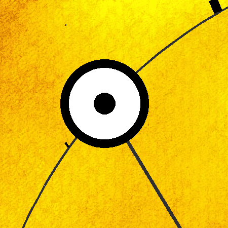

# Astronomical Clock ☀️

***Browser/PWA version of Gordon's Sun Clock* – A single-hand clock with a dial that changes daily, based on the rhythms of nature and the stars. A new way of displaying time that moves in harmony with the seasons**

This repository contains the web implementation of the natural-time sun clock, including local astronomical calculations, offline support, and the canvas-based dial. It is the ongoing web port of the original Android/Python app.

The web version uses JavaScript-based astronomical calculations (including VSOP87 and IAU 2000B), and does **not** provide the full Skyfield precision of the Android/Python version (JPL DE440 ephemerides). Some app features are still missing or incomplete, such as sun-based alarms and multiple designs.

## Features

- **Accurate solar positioning**: Within VSOP87 & IAU 2000B limiations (see [Android app](https://github.com/gaxmann/gordonssunclock) for more precision)
- **Single-hand design**: Simple, clear, intuitive
- **Location-based**: Adjusts to your coordinates (manual input or location detection)
- **Real time set/rise**: Sun and Moon rise and set according to their apparent size
- **Installable**: As a progressive web app
- **Offline capable**: No internet required after first setup (PWA)
- **Optional weather overview**: Clear icon-based, drama-free daily outlook
- **Temporal hours clock**: Display of ancient unequal hours (12 day hours & 4 night watches) – e.g. for historians or anyone seeking a deeper connection to historical timekeeping
- **Time travel:** explore past and future, even up to the sky at your birth
- **Meteor showers:** the eight major streams with search area and radiant  
- **Agnihotra support**: Display precise Agnihotra times with countdown
- **Tablet mode**: Hang on your wall as a living clock (maybe the Android app ist better suited for this)
- **Multi-language**: Deutsch, English, Español, Français, Русский, 中文 plus some autotranslated languages
- **Free & private**: Free of charge, no ads, privacy-friendly

Link to Astronomical Clock: https://astronomicalclock.eu/  
**Short link:** https://sky12.de/

Main Android repository: https://github.com/gaxmann/gordonssunclock

---

  
  

---

## Like it?

If you enjoy Sun Clock, please consider:
- Telling others about it – Short link: **sky12.de**
- Leaving a positive review on [Play Store](https://play.google.com/store/apps/details?id=de.ax12.zunclock) 
- Reading what others say on the [Voices on Sun Clock](https://github.com/gaxmann/gordonssunclock/wiki/Voices-on-Sun-Clock) wiki page

Enjoy using Sun Clock ☀️

