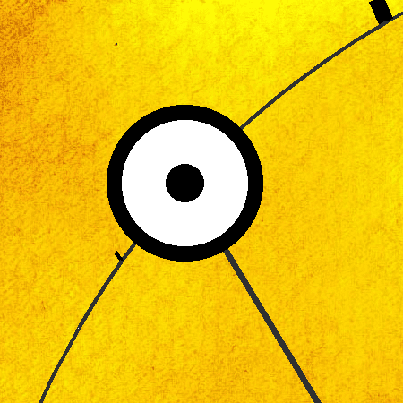

# Astronomical Clock – Local and Seasonal Time ☀️

***Browser/PWA version of Gordon's Sun Clock* – A single-hand clock with a dial that changes daily, based on the rhythms of nature and the stars. A new way of displaying time in harmony with the seasons**

Astronomical Clock is the browser/PWA implementation of the natural-time Sun Clock (2019). It performs astronomical calculations locally in JavaScript, supports offline use, and renders the clock as a canvas-based dial. It is the ongoing web port of the original Android/Python app. The web version uses VSOP87 and IAU 2000B and does **not** provide the full Skyfield precision of the Android/Python version with JPL DE440 ephemerides. Sun-based alarms are still missing.

This repository contains information about Astronomical Clock and its development history, including this README, the detailed changelog, and the shorter What's New overview.

## Features

- **Accurate solar positioning**: Within VSOP87 & IAU 2000B limitations (see [Android app](https://github.com/gaxmann/gordonssunclock) for JPL precision)
- **Single-hand design**: Simple, clear, intuitive
- **Location-based**: Adjusts to your coordinates (manual input or location detection)
- **Real-time rise/set**: Sun and Moon rise and set according to their apparent size
- **Installable**: As a progressive web app 
- **Offline capable**: No internet required after first setup (PWA)
- **Optional weather overview**: Clear icon-based, drama-free daily outlook
- **Temporal hours clock**: Display of ancient unequal hours (12 day hours & 4 night watches) – e.g. for historians or anyone seeking a deeper connection to historical timekeeping
- **Time travel:** Explore past and future skies, including the sky at your birth
- **Meteor showers:** the eight major streams with search area and radiant  
- **Agnihotra support**: Display precise Agnihotra times with countdown
- **Tablet mode**: Turn a tablet into a permanent wall clock (the Android app may be better suited for this)
- **Long-term project:** In continuous development since 2019
- **Free & private**: Free of charge, no ads, privacy-friendly

The following languages are currently fully supported: *English (en), Deutsch (de), Español (es), Français (fr), Русский (ru), Português (pt), Italiano (it), 中文 (zh), हिन्दी (hi), العربية (ar).* My long-term goal is to provide full support for the most widely used languages (Bengali, Indonesian are still missing). 

Link to Astronomical Clock: https://astronomicalclock.eu/  
**Short link:** https://sky12.de/  
Info: https://astronomicalclock.eu/info

Main Android repository and wiki: https://github.com/gaxmann/gordonssunclock

---

  
  

---

## Why this clock exists

*Natural time — making the rhythms we already live in visible again*

My Sun Clock project has been evolving for over seven years now, though I've been searching for a fitting way to represent seasonal time for more than 20.

At its heart, it is a clock. But unlike an ordinary clock, it doesn't treat time as an abstract framework that looks the same all year round. It aims to make time visible again as something local and seasonal, shaped by the actual movement of the Sun and by the annual rhythms our bodies are embedded in.

I was dissatisfied with clocks that never show when the Sun rises or sets, how high it stands in the sky, or how day length shifts through the year. At 12 o'clock it usually isn't noon, and clock changes push the frame even further from what's happening outside. The Sun, after all, does not change its clocks.

But astronomical knowledge was never really the point. It's a way back to a connection the body has never stopped living in. We can explain the tides, the seasons, the turning of the Earth, and still feel none of it. The point isn't to add knowledge here. It's to restore contact.

That's also, for me, where the word natural points beyond biology — toward something like Sky and Earth, toward a larger order I don't need to name to feel held by. The clock gives that a shape I can look at.

The organic clock face is built around the Sun's actual daily path at your location. A single hand carries the Sun along that path. Civil hours are marked along it, the horizon runs through the middle, and sunrise and sunset fall where the path crosses it, while the Moon, planets and bright stars share the same view. As the seasons change, so does the shape of that path.

Civil time is useful, but its fixed hours can quietly cover over how much the day itself changes through the year. The body already knows the rhythms underneath. The clock simply makes them visible again, and in that, I find something close to solace.

For me, the Sun Clock works best as a wall clock. I use an old Android tablet for this, the clock face showing throughout the day. In the evening, I like sitting in front of it, watching the positions of the celestial bodies, following the Sun's movement across the year, and feeling, even briefly, part of something larger than the day I've had.

In that sense, natural time means one thing: reconnection to the rhythms of the universe we're already part of.

---

## Like it?

If you enjoy Sun Clock, please consider:
- Share it with others – Short link: **sky12.de**
- Leaving a positive review on [Play Store](https://play.google.com/store/apps/details?id=de.ax12.zunclock) 
- Reading what others say on the [Voices on Sun Clock](https://github.com/gaxmann/gordonssunclock/wiki/Voices-on-Sun-Clock) wiki page

Enjoy using Sun Clock ☀️
